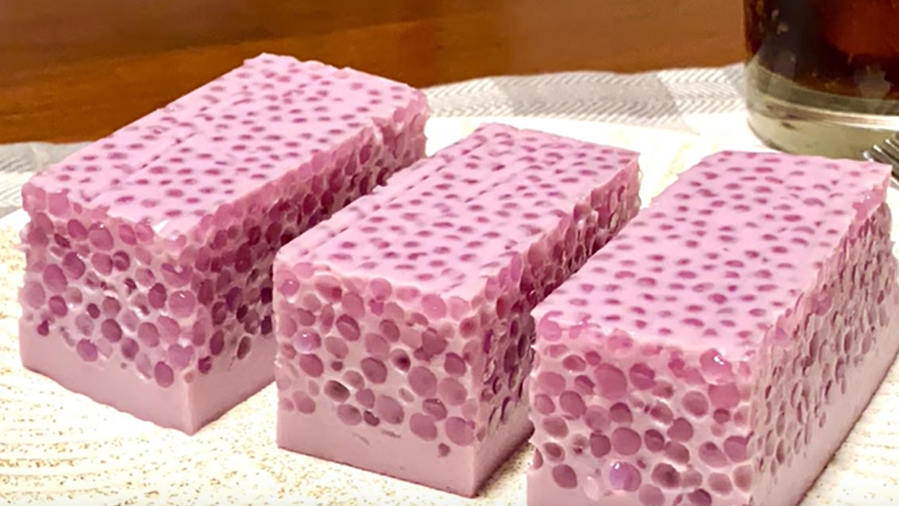

## [椰子冻](#yezidong)

*  椰子一个　water 约200ml
*  牛奶，coco milk: 总量与coco water基本1:1, 可以稍微多点
*  放13g左右吉利丁片，约7片 (冷水+冰块泡软), 5片
*  隔水加热: 效果+量杯, 加入少许糖

最新 2023 12.30： 400ml. 5片

每片1.67g AI advise: per 100ml = 1.5-2g
400ml = 8g / 1.67g = 4.79片 = 5片

口感差不多，可以再稍微嫩一点

reference: https://www.zhihu.com/question/34428166

TODO: 抹茶椰子冻: https://www.sidechef.cn/recipes/7381/%E6%8A%B9%E8%8C%B6%E6%A4%B0%E5%AD%90%E5%86%BB/

# 紫薯椰汁西米糕

  

https://www.youtube.com/watch?v=u3kJ2udgiZc

Note: 

*  用烘培纸垫在膜具，放凉jelly. i.e 代替保鲜膜
*  冷藏前撇去气泡

# Sago 西米的做法

*  水要够
*  焖熟

[Sago cooking skills taught by sago shop owner](https://www.youtube.com/watch?v=0jilGWVWbl8)